# ARCHITECTURE_DIAGRAMS.md

> **Diagrammi Architetturali di Osservatorio**
> Questa documentazione contiene i diagrammi Mermaid che illustrano l'architettura e i flussi del sistema.

## 📊 Indice Diagrammi

1. [Architettura Generale](#architettura-generale)
2. [Flusso Dati (Raw → Clean → Business)](#flusso-dati)
3. [Componenti Dashboard](#componenti-dashboard)
4. [Database Architecture](#database-architecture)
5. [API Integration Flow](#api-integration-flow)
6. [Security & Rate Limiting](#security--rate-limiting)
7. [Deployment Architecture](#deployment-architecture)

## 🏗️ Architettura Generale

## 🔄 Flusso Dati

## 🎨 Componenti Dashboard

```mermaid
graph TD
    subgraph "Streamlit App Structure"
        MAIN[streamlit_app.py<br/>Entry Point]

        subgraph "Pages"
            P1[📊 Home]
            P2[👥 Popolazione]
            P3[🏥 Sanità]
            P4[💼 Lavoro]
            P5[📈 Analytics]
        end

        subgraph "Components"
            C1[Sidebar Navigator]
            C2[Data Selector]
            C3[Chart Builder]
            C4[Export Manager]
            C5[Filter Panel]
        end

        subgraph "Utils"
            U1[Session Manager]
            U2[Cache Manager]
            U3[Theme Manager]
            U4[Auth Handler]
        end
    end

    MAIN --> P1
    MAIN --> C1
    C1 --> P2
    C1 --> P3
    C1 --> P4
    C1 --> P5

    P1 --> C2
    P1 --> C3
    P2 --> C2
    P2 --> C3
    P2 --> C5

    C2 --> U2
    C3 --> C4
    C1 --> U1
    MAIN --> U3
    MAIN --> U4
```

## 🗄️ Database Architecture

## 🔌 API Integration Flow

## 🔒 Security & Rate Limiting

## 🚀 Deployment Architecture

---

> **Note**: Questi diagrammi sono stati generati con Mermaid.js e sono compatibili con GitHub, GitLab e la maggior parte dei viewer Markdown moderni.
>
> Per visualizzare correttamente i diagrammi:
> - **GitHub**: Supporto nativo
> - **VS Code**: Estensione "Mermaid Preview"
> - **Local**: Live Server con Mermaid.js CDN
