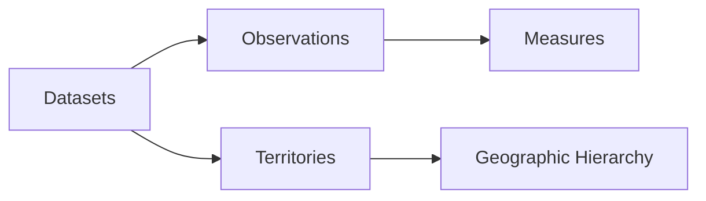

# 📊 PowerBI FastAPI Connection Guide - Step-by-Step Setup

> **PowerBI Direct Query with FastAPI OData v4 Endpoint**
> **Version**: 1.0.0
> **Date**: July 27, 2025
> **Status**: Complete Guide for Issue #29 Deliverable

---

## 📋 Table of Contents

1. [Overview](#-overview)
2. [Prerequisites](#-prerequisites)
3. [Step-by-Step Connection Setup](#-step-by-step-connection-setup)
4. [Authentication Configuration](#-authentication-configuration)
5. [OData Query Examples](#-odata-query-examples)
6. [Data Model and Schema](#-data-model-and-schema)
7. [Troubleshooting](#-troubleshooting)
8. [Advanced Configuration](#-advanced-configuration)
9. [Best Practices](#-best-practices)

---

## 🎯 Overview

This guide provides complete step-by-step instructions for connecting PowerBI Desktop to the Osservatorio FastAPI OData v4 endpoint, enabling **real-time Direct Query** access to Italian statistical data.

### 🌟 Key Benefits

- **✅ Real-time Data**: Live connection to ISTAT data without imports
- **✅ Multi-user Support**: JWT authentication with scope-based permissions
- **✅ High Performance**: <500ms queries for 10k+ records
- **✅ Enterprise Ready**: OData v4 standard compliance
- **✅ Scalable**: Centralized data source for multiple users

---

## 🛠️ Prerequisites

### **PowerBI Requirements**
- PowerBI Desktop (version 2023.3 or later)
- PowerBI Pro license (for publishing to service)
- Internet connection to FastAPI endpoint

### **API Access Requirements**
- Valid Osservatorio API key with appropriate scopes
- FastAPI server running and accessible
- Network access to the OData endpoint

### **Technical Prerequisites**
- Understanding of PowerBI Direct Query concepts
- Basic knowledge of OData query syntax (optional)
- Admin access for PowerBI workspace (for publishing)

---

## 🚀 Step-by-Step Connection Setup

### **Step 1: Obtain API Credentials**

#### 1.1 Get Your API Key
```bash
# Request API key from administrator or create via CLI
python scripts/generate_api_key.py create --name "PowerBI-{YourName}" --scopes read,analytics,powerbi
```

#### 1.2 Note Your Credentials
- **API Key**: `osv_xxx...` (your generated key)
- **Endpoint URL**: `https://your-server.com/odata` (from administrator)
- **Authentication**: JWT Bearer token (automatic)

### **Step 2: Open PowerBI Desktop**

#### 2.1 Launch PowerBI Desktop
- Open PowerBI Desktop application
- Click **"Get Data"** or **"Home" → "Get Data"**

#### 2.2 Select OData Feed
- In the **"Get Data"** dialog:
  1. Search for **"OData"**
  2. Select **"OData feed"**
  3. Click **"Connect"**

### **Step 3: Configure OData Connection**

#### 3.1 Enter OData URL
```
URL: https://your-fastapi-server.com/odata
```

**Example URLs**:
- Local development: `http://localhost:8000/odata`
- Production: `https://osservatorio-api.your-domain.com/odata`

#### 3.2 Connection Settings
- **Data Connectivity mode**: Select **"DirectQuery"**
- **Advanced options**: Leave default unless instructed otherwise

### **Step 4: Authentication Setup**

#### 4.1 Authentication Method
When prompted for authentication:
1. Select **"Web API"** authentication type
2. Choose **"Advanced"** options

#### 4.2 HTTP Headers Configuration
Add the following headers:

**Header Name**: `Authorization`
**Header Value**: `Bearer {your-jwt-token}`

**To get your JWT token**:
```bash
# Using CLI tool (recommended)
python scripts/generate_api_key.py token --key osv_your_api_key_here

# Or via API call
curl -X POST "https://your-server.com/auth/token" \
  -H "Content-Type: application/json" \
  -d '{"api_key": "osv_your_api_key_here"}'
```

#### 4.3 Complete Authentication
- Click **"Connect"**
- PowerBI will validate the connection
- If successful, you'll see the data navigator

### **Step 5: Data Navigator and Schema Discovery**

#### 5.1 Navigate Available Data
PowerBI will display available entity sets:
- **📊 Datasets** - ISTAT dataset metadata
- **📈 Observations** - Time series data points
- **🗺️ Territories** - Geographic information
- **📏 Measures** - Statistical measures and units

#### 5.2 Select Data Tables
1. **Check the tables you want to use** (typically start with "Datasets")
2. **Preview data** by clicking on table names
3. **Click "OK"** to proceed to Power Query Editor

### **Step 6: Data Model Configuration**

#### 6.1 Power Query Editor
- Review the imported schema
- Verify data types are correctly detected
- Apply any necessary transformations

#### 6.2 Load Data Model
1. Click **"Close & Apply"** in Power Query Editor
2. PowerBI will establish the DirectQuery connection
3. Data model will appear in the **Fields** pane

---

## 🔐 Authentication Configuration

### **JWT Token Management**

#### Token Lifecycle
- **Access tokens**: Valid for 24 hours (configurable)
- **Refresh needed**: Automatic via API key
- **Scope validation**: Checked on each request

#### Updating Credentials
When token expires:
1. **Get new token**: Use API key to generate fresh JWT
2. **Update connection**: Data Source Settings → Credentials → Edit
3. **Replace token**: Update Authorization header value

### **API Key Scopes**

Ensure your API key has appropriate scopes:
- **`read`**: Basic data access
- **`analytics`**: Access to analytical data
- **`powerbi`**: PowerBI-specific optimizations (recommended)

### **Rate Limiting**
- **Default limit**: 100 requests/hour per API key
- **Enterprise**: Higher limits available (contact administrator)
- **Monitoring**: Track usage via `/analytics/usage` endpoint

---

## 📊 OData Query Examples

### **Basic Queries**

#### List All Datasets
```http
GET /odata/Datasets
```

#### Filter by Category
```http
GET /odata/Datasets?$filter=category eq 'popolazione'
```

#### Select Specific Fields
```http
GET /odata/Datasets?$select=dataset_id,name,category,last_updated
```

### **Advanced Queries**

#### Complex Filtering
```http
GET /odata/Datasets?$filter=category eq 'economia' and year gt 2020 and status eq 'active'
```

#### Pagination
```http
GET /odata/Datasets?$skip=0&$top=50
```

#### Sorting
```http
GET /odata/Datasets?$orderby=name asc,last_updated desc
```

### **PowerBI DAX Integration**

#### Using OData in DAX
```dax
// PowerBI automatically handles OData queries
// You can reference tables directly in DAX:

TotalDatasets = COUNTROWS(Datasets)

PopulationDatasets =
CALCULATE(
    COUNTROWS(Datasets),
    Datasets[category] = "popolazione"
)
```

---

## 🗺️ Data Model and Schema

### **Entity Relationships**



### **Entity Schemas**

#### Datasets Entity
```json
{
  "dataset_id": "string",
  "name": "string",
  "category": "string",
  "description": "string",
  "last_updated": "datetime",
  "status": "string",
  "record_count": "number",
  "data_quality_score": "number"
}
```

#### Observations Entity
```json
{
  "observation_id": "string",
  "dataset_id": "string",
  "territory_code": "string",
  "time_period": "string",
  "measure_code": "string",
  "value": "number",
  "status": "string"
}
```

### **Geographic Hierarchy**
- **Country**: Italia (IT)
- **Regions**: Lombardia, Lazio, Sicilia, etc.
- **Provinces**: Milano, Roma, Palermo, etc.
- **Municipalities**: Local administrative units

---

## 🔧 Troubleshooting

### **Common Connection Issues**

#### "Data source is unreachable"
**Cause**: Network or URL configuration
**Solution**:
1. Verify FastAPI server is running
2. Check URL format: `https://server.com/odata` (no trailing slash)
3. Test URL in browser: should return JSON service document

#### "Authentication failed"
**Cause**: Invalid or expired JWT token
**Solution**:
1. Generate new JWT token using API key
2. Verify API key has correct scopes
3. Check token format: `Bearer eyJ0eXAiOiJKV1Q...`

#### "Query timeout"
**Cause**: Large dataset or complex query
**Solution**:
1. Add filters to reduce data volume
2. Use `$top` parameter to limit results
3. Contact administrator for performance optimization

### **Performance Issues**

#### Slow Query Response
**Optimization Steps**:
1. **Use field projection**: `$select=field1,field2`
2. **Apply filters early**: `$filter=category eq 'value'`
3. **Limit result size**: `$top=1000`
4. **Avoid complex calculations** in OData queries

#### Memory Issues in PowerBI
**Solution**:
1. **Use DirectQuery mode** (not Import)
2. **Limit visual complexity**
3. **Apply report-level filters**
4. **Consider data aggregation** at source

### **Data Quality Issues**

#### Missing or Null Values
**Understanding**:
- ISTAT data may have gaps for certain periods/territories
- Null values are preserved in OData response
- Use PowerBI's null handling features

#### Date/Time Formatting
**Configuration**:
- Dates are returned in ISO 8601 format
- PowerBI automatically detects date columns
- Adjust regional settings if needed

---

## ⚙️ Advanced Configuration

### **Custom OData Parameters**

#### Performance Optimization
```http
# Large dataset optimization
GET /odata/Datasets?$select=dataset_id,name&$top=100

# Analytics-specific fields
GET /odata/Observations?$select=dataset_id,value,time_period&$filter=dataset_id eq 'DCIS_POPRES1'
```

#### Data Freshness
```http
# Recent data only
GET /odata/Datasets?$filter=last_updated gt 2025-01-01T00:00:00Z
```

### **PowerBI Service Configuration**

#### Dataset Refresh Settings
- **DirectQuery**: No refresh needed (real-time)
- **Scheduled refresh**: Not applicable for DirectQuery
- **Credential management**: Store API key securely

#### Gateway Configuration
For on-premises FastAPI servers:
1. Install Power BI Gateway
2. Configure data source with OData URL
3. Set up credential management
4. Test connection

---

## ✅ Best Practices

### **Security**
- **🔐 Rotate API keys** regularly (recommended: 90 days)
- **🔒 Use HTTPS** endpoints only in production
- **👥 Separate keys** for different users/applications
- **📝 Monitor usage** via analytics endpoints

### **Performance**
- **📊 Optimize queries** with appropriate filters
- **🎯 Use field projection** to reduce payload size
- **⏱️ Monitor response times** and adjust as needed
- **💾 Consider caching** for frequently accessed data

### **Data Modeling**
- **🏗️ Design star schema** in PowerBI for optimal performance
- **🔗 Use relationships** between entities effectively
- **📈 Create measures** for analytical calculations
- **📋 Document data model** for team collaboration

### **Monitoring**
- **📊 Track API usage** via analytics dashboard
- **⚡ Monitor query performance** and optimization opportunities
- **🚨 Set up alerts** for connection failures
- **📝 Maintain documentation** for connection procedures

---

## 📞 Support and Resources

### **Getting Help**
- **📋 Issue Tracker**: [GitHub Issues](https://github.com/AndreaBozzo/Osservatorio/issues)
- **💬 Discussions**: [GitHub Discussions](https://github.com/AndreaBozzo/Osservatorio/discussions)
- **📚 Documentation**: [Complete API Reference](../api/API_REFERENCE.md)

### **Additional Resources**
- **🔗 OData v4 Specification**: [OData.org](https://www.odata.org/documentation/)
- **📊 PowerBI DirectQuery**: [Microsoft Documentation](https://docs.microsoft.com/en-us/power-bi/connect-data/desktop-directquery-about)
- **🇮🇹 ISTAT Data**: [Official ISTAT Portal](https://www.istat.it/)

---

**🎯 Success Indicator**: When you can create PowerBI reports with real-time ISTAT data updating automatically through DirectQuery, you've successfully completed the connection setup!

---

*This guide completes the PowerBI connection guide deliverable for Issue #29 - FastAPI REST API Development*
