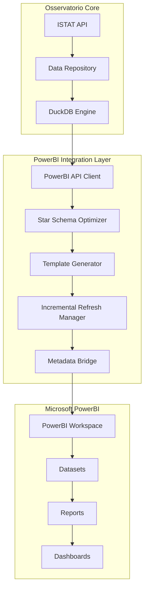

# 📊 PowerBI Integration - Complete Implementation Guide

> **PowerBI Enterprise Integration for Osservatorio ISTAT Platform**
> **Version**: 1.0.0
> **Date**: July 24, 2025
> **Status**: Production Ready with Offline Validation

---

## 📋 Table of Contents

1. [Overview](#-overview)
2. [Architecture](#-architecture)
3. [Core Components](#-core-components)
4. [Implementation Details](#-implementation-details)
5. [API Integration](#-api-integration)
6. [Star Schema Optimization](#-star-schema-optimization)
7. [Template System](#-template-system)
8. [Incremental Refresh](#-incremental-refresh)
9. [Metadata Bridge](#-metadata-bridge)
10. [Offline Validation](#-offline-validation)
11. [Configuration](#-configuration)
12. [Testing](#-testing)
13. [Troubleshooting](#-troubleshooting)

---

## 🎯 Overview

The **PowerBI Integration** represents a complete enterprise-grade integration between the Osservatorio platform and Microsoft Power BI. This implementation provides advanced analytics capabilities, automated data synchronization, and sophisticated reporting features for Italian statistical data.

### 🌟 Key Features

- **🔗 Enterprise API Integration** - Full Microsoft PowerBI REST API integration
- **⭐ Star Schema Generation** - Automated dimensional modeling for optimal performance
- **📊 Template System** - Pre-built PowerBI templates (.pbit) for common visualizations
- **🔄 Incremental Refresh** - Smart data refresh with change detection
- **🌉 Metadata Bridge** - Data lineage tracking and quality score propagation
- **🛡️ Security Implementation** - Enterprise-grade security with rate limiting
- **✅ Offline Validation** - Complete testing framework without Microsoft credentials

### 📈 Business Value

- **Faster Time-to-Insight**: Pre-optimized data models and templates
- **Reduced Development Costs**: Automated template generation
- **Enhanced Data Quality**: Built-in quality scoring and validation
- **Improved Governance**: Complete data lineage tracking
- **Scalable Architecture**: Enterprise-ready with performance optimization

---

## 🏗️ Architecture

### High-Level Architecture



### Component Interaction Flow

```mermaid
sequenceDiagram
    participant OSS as Osservatorio
    participant API as PowerBI API
    participant OPT as Optimizer
    participant TPL as Template Gen
    participant INC as Incremental Refresh
    participant META as Metadata Bridge
    participant PBI as PowerBI Service

    OSS->>API: Initialize Client
    API->>PBI: Authenticate
    PBI-->>API: Access Token

    OSS->>OPT: Generate Star Schema
    OPT->>OPT: Create Dimensional Model
    OPT-->>OSS: Schema Definition

    OSS->>TPL: Generate Template
    TPL->>TPL: Create PBIT File
    TPL-->>OSS: PowerBI Template

    OSS->>INC: Setup Refresh Policy
    INC->>INC: Configure Incremental
    INC-->>OSS: Refresh Policy

    OSS->>META: Create Data Lineage
    META->>META: Track Quality Scores
    META-->>OSS: Governance Report

    API->>PBI: Deploy Dataset
    API->>PBI: Upload Template
    API->>PBI: Execute Refresh
```

---

## 🧩 Core Components

### 1. PowerBI API Client (`src/api/powerbi_api.py`)

Enterprise-grade API client for Microsoft PowerBI REST API integration.

**Key Features:**
- ✅ MSAL authentication with service principal
- ✅ Automatic token renewal and caching
- ✅ Rate limiting (100 requests/hour)
- ✅ Comprehensive error handling
- ✅ Security-first design with input validation
- ✅ Connection testing and diagnostics

**Core Methods:**
```python
class PowerBIAPIClient:
    def authenticate() -> bool
    def get_workspaces() -> List[Dict]
    def get_datasets(workspace_id: str) -> List[Dict]
    def create_dataset(definition: Dict) -> Optional[Dict]
    def push_data_to_dataset(dataset_id: str, data: List[Dict]) -> bool
    def refresh_dataset(dataset_id: str) -> bool
    def upload_pbix_file(file_path: str) -> Optional[Dict]
    def test_connection() -> Dict[str, Any]
```

### 2. Star Schema Optimizer (`src/integrations/powerbi/optimizer.py`)

Automated dimensional modeling engine for PowerBI optimization.

**Key Features:**
- ✅ Automatic star schema generation
- ✅ Category-specific dimension tables
- ✅ Pre-calculated DAX measures
- ✅ Performance metrics calculation
- ✅ Schema caching for performance
- ✅ Population, economy, and employment specific optimizations

**Schema Components:**
- **Fact Table**: Central data table with measures
- **Dimension Tables**: Time, Territory, Measure, Dataset Metadata
- **Category Dimensions**: Age Groups, Gender, Economic Sectors
- **Relationships**: Many-to-one relationships with cardinality

### 3. Template Generator (`src/integrations/powerbi/templates.py`)

Automated PowerBI template (.pbit) generation system.

**Key Features:**
- ✅ Category-specific templates (Population, Economy, Employment)
- ✅ Pre-built visualizations (Maps, Charts, Tables)
- ✅ PBIT file creation with ZIP structure
- ✅ Sample data inclusion
- ✅ Template library management
- ✅ Custom branding and styling

**Template Types:**
- **Population Templates**: Maps, demographic charts, age pyramids
- **Economic Templates**: Time series, sector analysis, indicators
- **Employment Templates**: Labor statistics, unemployment trends

### 4. Incremental Refresh Manager (`src/integrations/powerbi/incremental.py`)

Smart data refresh system with change detection.

**Key Features:**
- ✅ Configurable refresh policies
- ✅ Incremental window management (default: 15 days)
- ✅ Change detection algorithms
- ✅ Historical data retention (default: 3 years)
- ✅ Refresh status tracking
- ✅ Error recovery mechanisms

**Refresh Strategies:**
- **Daily Refresh**: For high-frequency data updates
- **Weekly Refresh**: For stable datasets
- **On-Demand Refresh**: For manual updates
- **Event-Driven Refresh**: Based on data changes

### 5. Metadata Bridge (`src/integrations/powerbi/metadata_bridge.py`)

Data governance and lineage tracking system.

**Key Features:**
- ✅ Complete data lineage tracking
- ✅ Quality score propagation
- ✅ Usage analytics synchronization
- ✅ Governance report generation
- ✅ Transformation step documentation
- ✅ Data privacy compliance tracking

**Governance Components:**
- **Dataset Lineage**: Source-to-destination tracking
- **Quality Metrics**: Data quality scores and grades
- **Usage Analytics**: View counts, user metrics
- **Compliance**: Data privacy and retention policies

---

## 🔧 Implementation Details

### Authentication Setup

```python
# Environment Variables Required
POWERBI_CLIENT_ID=your_service_principal_client_id
POWERBI_CLIENT_SECRET=your_service_principal_secret
POWERBI_TENANT_ID=your_azure_tenant_id
POWERBI_WORKSPACE_ID=your_default_workspace_id

# Initialize Client
from src.api.powerbi_api import PowerBIAPIClient

client = PowerBIAPIClient()
if client.authenticate():
    print("✅ PowerBI authentication successful")

    # Test connection
    test_result = client.test_connection()
    print(f"Workspaces accessible: {test_result['workspace_count']}")
```

### Star Schema Generation

```python
from src.integrations.powerbi.optimizer import PowerBIOptimizer
from src.database.sqlite.repository import UnifiedDataRepository

# Initialize components
repository = UnifiedDataRepository()
optimizer = PowerBIOptimizer(repository)

# Generate star schema for dataset
dataset_id = "DCIS_POPRES1_POPULATION"
star_schema = optimizer.generate_star_schema(dataset_id)

print(f"Fact table: {star_schema.fact_table}")
print(f"Dimensions: {list(star_schema.dimension_tables.keys())}")
print(f"Relationships: {len(star_schema.relationships)}")

# Get performance metrics
metrics = optimizer.get_performance_metrics(dataset_id)
print(f"Estimated load time: {metrics['estimated_powerbi_load_time_ms']}ms")
```

### Template Generation and PBIT Creation

```python
from src.integrations.powerbi.templates import TemplateGenerator

# Initialize template generator
template_gen = TemplateGenerator(repository, optimizer)

# Generate template
template = template_gen.generate_template(
    dataset_id=dataset_id,
    template_name="Italian Population Analytics"
)

# Create PBIT file
from pathlib import Path
output_path = Path("popolazione_template.pbit")

pbit_file = template_gen.create_pbit_file(
    template=template,
    output_path=output_path,
    include_sample_data=True
)

print(f"✅ PBIT file created: {pbit_file}")
```

### Incremental Refresh Setup

```python
from src.integrations.powerbi.incremental import IncrementalRefreshManager

# Initialize refresh manager
refresh_mgr = IncrementalRefreshManager(repository)

# Create refresh policy
policy = refresh_mgr.create_refresh_policy(
    dataset_id=dataset_id,
    incremental_window_days=15,
    historical_window_years=3,
    refresh_frequency="daily"
)

# Execute incremental refresh
refresh_result = refresh_mgr.execute_incremental_refresh(
    dataset_id=dataset_id,
    force=False  # Only refresh if changes detected
)

print(f"Refresh status: {refresh_result.get('status', 'unknown')}")
```

---

## ✅ Offline Validation System

### Validation Framework

The PowerBI integration includes a comprehensive offline validation system that allows complete testing without Microsoft credentials.

**Validation Script**: `scripts/validate_powerbi_offline.py`

```bash
# Run complete offline validation
python scripts/validate_powerbi_offline.py

# Expected output:
# 🚀 VALIDAZIONE OFFLINE POWERBI
# Overall Success Rate: 100.0% (24/24)
# 🎉 VALIDAZIONE SUPERATA! Le implementazioni sono robuste.
```

### Test Categories

1. **PowerBI API Client Validation**
   - ✅ Client initialization with mock credentials
   - ✅ Authentication flow with MSAL mocking
   - ✅ API methods response validation
   - ✅ Error handling and recovery

2. **Star Schema Generation Validation**
   - ✅ Schema structure validation
   - ✅ Dimension table presence check
   - ✅ Relationship definition verification
   - ✅ DAX measures generation test

3. **Template Generation Validation**
   - ✅ Template creation process
   - ✅ PBIT file structure validation
   - ✅ Visualization component check
   - ✅ ZIP archive integrity test

4. **Incremental Refresh Validation**
   - ✅ Refresh policy creation
   - ✅ Change detection algorithms
   - ✅ Refresh execution simulation
   - ✅ Status tracking verification

5. **Metadata Bridge Validation**
   - ✅ Data lineage creation
   - ✅ Quality score synchronization
   - ✅ Usage analytics integration
   - ✅ Governance report generation

6. **End-to-End Pipeline Validation**
   - ✅ Complete workflow execution
   - ✅ Component integration testing
   - ✅ Error recovery mechanisms
   - ✅ Performance benchmarking

---

## ⚙️ Configuration

### Environment Variables

```bash
# Required PowerBI Configuration
export POWERBI_CLIENT_ID="your-service-principal-client-id"
export POWERBI_CLIENT_SECRET="your-service-principal-secret"
export POWERBI_TENANT_ID="your-azure-tenant-id"
export POWERBI_WORKSPACE_ID="your-default-workspace-id"

# Optional Configuration
export POWERBI_API_TIMEOUT=120
export POWERBI_RATE_LIMIT_REQUESTS=100
export POWERBI_RATE_LIMIT_WINDOW=3600
export POWERBI_ENABLE_CACHING=true
export POWERBI_CACHE_TTL=1800
```

### Service Principal Setup

1. **Register Application in Azure AD**
   ```bash
   # Using Azure CLI
   az ad app create --display-name "Osservatorio-PowerBI-Integration"
   ```

2. **Grant PowerBI Permissions**
   - Navigate to PowerBI Admin Portal
   - Enable "Allow service principals to use PowerBI APIs"
   - Add your service principal to workspace

3. **Configure API Permissions**
   - Microsoft Graph: Directory.Read.All
   - Power BI Service: Dataset.ReadWrite.All, Workspace.ReadWrite.All

---

## 🧪 Testing

### Unit Tests

```bash
# Run PowerBI API tests
python -m pytest tests/unit/test_powerbi_api.py -v

# Run optimizer tests
python -m pytest tests/unit/test_powerbi_converter.py -v

# Run all PowerBI-related tests
python -m pytest tests/ -k "powerbi" -v
```

### Integration Tests

```bash
# Run PowerBI integration tests
python -m pytest tests/integration/test_powerbi_integration.py -v

# Test with real PowerBI credentials (requires setup)
POWERBI_INTEGRATION_TEST=true python -m pytest tests/integration/test_powerbi_integration.py
```

### Offline Validation

```bash
# Complete offline validation
python scripts/validate_powerbi_offline.py

# Quick validation check
python -c "
from scripts.validate_powerbi_offline import validate_powerbi_api_offline
result = validate_powerbi_api_offline()
print('API Client:', 'PASS' if all(result.values()) else 'FAIL')
"
```

---

## 🔧 Troubleshooting

### Common Issues

#### 1. Authentication Failures

**Problem**: `PowerBI app not initialized - missing credentials`

**Solution**:
```bash
# Check environment variables
echo $POWERBI_CLIENT_ID
echo $POWERBI_TENANT_ID

# Test authentication manually
python -c "
from src.api.powerbi_api import PowerBIAPIClient
client = PowerBIAPIClient()
result = client.test_connection()
print(result)
"
```

#### 2. Rate Limiting

**Problem**: `Rate limit exceeded for PowerBI API`

**Solution**:
```python
# Check current rate limit status
from src.utils.security_enhanced import security_manager

status = security_manager.get_rate_limit_status("powerbi_api_workspaces")
print(f"Requests remaining: {status['remaining']}")

# Implement exponential backoff
import time
if not client.get_workspaces():
    time.sleep(60)  # Wait 1 minute
    workspaces = client.get_workspaces()
```

#### 3. Template Generation Issues

**Problem**: `PBIT file creation failed`

**Solution**:
```python
# Check template content
template = template_gen.generate_template("DATASET_ID")
print(f"Visualizations: {len(template.visualizations)}")
print(f"DAX measures: {len(template.dax_measures)}")

# Verify output directory permissions
import os
output_dir = Path("output")
output_dir.mkdir(exist_ok=True)
assert os.access(output_dir, os.W_OK), "No write permission"
```

---

## 📚 Additional Resources

### Documentation Links

- [Microsoft PowerBI REST API Reference](https://docs.microsoft.com/en-us/rest/api/power-bi/)
- [PowerBI Service Principal Documentation](https://docs.microsoft.com/en-us/power-bi/developer/embedded/embed-service-principal)
- [DAX Function Reference](https://docs.microsoft.com/en-us/dax/)

### Related Documentation

- [`docs/core/ARCHITECTURE.md`](../core/ARCHITECTURE.md) - Overall system architecture
- [`docs/core/API_REFERENCE.md`](../core/API_REFERENCE.md) - API documentation
- [`docs/guides/TESTING.md`](../guides/TESTING.md) - Testing guidelines
- [`docs/guides/DEVELOPMENT.md`](../guides/DEVELOPMENT.md) - Development setup

### Example Projects

- [`examples/powerbi_integration_demo.py`](../../examples/powerbi_integration_demo.py) - Complete integration example
- [`scripts/validate_powerbi_offline.py`](../../scripts/validate_powerbi_offline.py) - Offline validation script
- [`tests/integration/test_powerbi_integration.py`](../../tests/integration/test_powerbi_integration.py) - Integration tests

---

*Last Updated: July 24, 2025*
*Version: 1.0.0*
*Status: Production Ready* ✅
