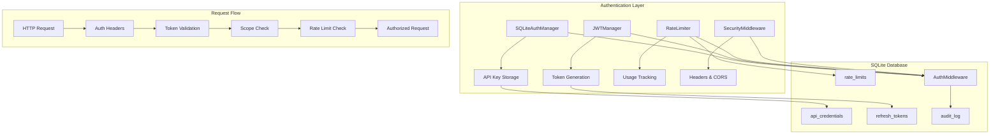
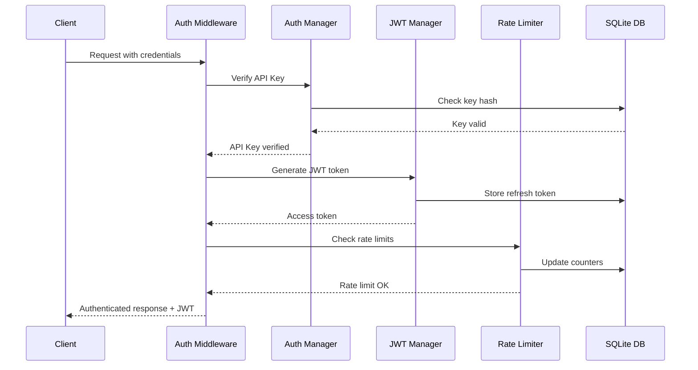

# 🔐 Authentication & Security System - Day 7 Implementation

> **SQLite-Based JWT Authentication with Enterprise Security**
> **Version**: 1.1.0
> **Date**: July 28, 2025
> **Status**: Production Ready ✅

---

## 📋 Table of Contents

1. [Overview](#-overview)
2. [Architecture](#-architecture)
3. [API Key Management](#-api-key-management)
4. [JWT Authentication](#-jwt-authentication)
5. [Rate Limiting](#-rate-limiting)
6. [Security Headers](#-security-headers)
7. [Usage Examples](#-usage-examples)
8. [Security Best Practices](#-security-best-practices)
9. [CLI Tools](#-cli-tools)
10. [Testing](#-testing)
11. [Troubleshooting](#-troubleshooting)

---

## 🎯 Overview

The **Authentication & Security System** provides enterprise-grade security for the Osservatorio ISTAT platform with SQLite-backed authentication, JWT tokens, rate limiting, and OWASP-compliant security headers.

### 🌟 Key Features

- **🔑 SQLite API Key Management** - Cryptographically secure API keys with scopes
- **🎫 JWT Token System** - RS256/HS256 JWT with refresh tokens
- **⚡ Rate Limiting** - Sliding window algorithm with SQLite backend
- **🛡️ Security Headers** - OWASP-compliant middleware
- **🔍 Audit Logging** - Complete security event tracking
- **⚙️ CLI Management** - Command-line tools for key management

### 📈 Security Features

- **Bcrypt Key Hashing** - Industry-standard password hashing
- **Token Blacklisting** - Secure logout and revocation
- **Scope-Based Permissions** - Fine-grained access control
- **Rate Limit Protection** - DDoS and abuse prevention
- **Security Headers** - XSS, CSRF, and clickjacking protection

---

## 🏗️ Architecture

### Component Overview



### Authentication Flow



---

## 🔑 API Key Management

### SQLiteAuthManager

The core component for managing API keys with SQLite backend.

```python
from src.auth.sqlite_auth import SQLiteAuthManager
from src.database.sqlite.manager import SQLiteMetadataManager

# Initialize
sqlite_mgr = SQLiteMetadataManager()
auth_mgr = SQLiteAuthManager(sqlite_mgr)

# Generate API key
api_key = auth_mgr.generate_api_key(
    name="My Application",
    scopes=["read", "write", "analytics"],
    expires_days=90  # Optional expiration
)

print(f"API Key: {api_key.key}")
print(f"Scopes: {api_key.scopes}")
```

### Available Scopes

| Scope | Description | Permissions |
|-------|-------------|-------------|
| `read` | Read-only access | Dataset queries, metadata |
| `write` | Write access | Data uploads, modifications |
| `admin` | Administrative | All permissions |
| `analytics` | Analytics access | PowerBI, Tableau integration |
| `powerbi` | PowerBI specific | PowerBI API endpoints |
| `tableau` | Tableau specific | Tableau API endpoints |

### API Key Format

- **Prefix**: `osv_` (Osservatorio identifier)
- **Length**: 32 characters (base64url encoded)
- **Security**: Cryptographically secure random generation
- **Storage**: Bcrypt hashed with salt

Example: `osv_abc123def456ghi789jkl012mno345pqr678`

---

## 🎫 JWT Authentication

### JWTManager

JWT token generation and validation with refresh token support.

```python
from src.auth.jwt_manager import JWTManager

# Initialize with HMAC (HS256)
jwt_mgr = JWTManager(sqlite_mgr, secret_key="your-secret-key")

# Or with RSA (RS256) - more secure for distributed systems
jwt_mgr = JWTManager(sqlite_mgr, algorithm="RS256")

# Create access token
auth_token = jwt_mgr.create_access_token(api_key)

print(f"Access Token: {auth_token.access_token}")
print(f"Expires in: {auth_token.expires_in} seconds")
print(f"Refresh Token: {auth_token.refresh_token}")
```

### Token Structure

**JWT Claims:**
```json
{
  "sub": "123",                    // API key ID
  "iss": "osservatorio-istat",     // Issuer
  "aud": "osservatorio-api",       // Audience
  "exp": 1690123456,               // Expiration
  "iat": 1690120456,               // Issued at
  "scope": "read write analytics", // Permissions
  "api_key_name": "My App",        // Key name
  "rate_limit": 1000,              // Rate limit
  "jti": "unique-token-id"         // JWT ID
}
```

### Token Validation

```python
# Verify token
claims = jwt_mgr.verify_token(access_token)

if claims:
    print(f"User ID: {claims.sub}")
    print(f"Scopes: {claims.scope.split()}")
    print(f"Expires: {claims.exp}")
else:
    print("Token invalid or expired")
```

---

## ⚡ Rate Limiting

### SQLiteRateLimiter

Sliding window rate limiting with SQLite backend.

```python
from src.auth.rate_limiter import SQLiteRateLimiter

# Initialize
rate_limiter = SQLiteRateLimiter(sqlite_mgr)

# Check rate limit
result = rate_limiter.check_rate_limit(
    api_key=api_key_obj,
    ip_address="192.168.1.100",
    endpoint="data/query",
    user_agent="MyApp/1.0"
)

if result.allowed:
    print(f"Request allowed, {result.remaining} remaining")
    # Process request
else:
    print(f"Rate limited! Retry after {result.retry_after} seconds")
    # Return 429 Too Many Requests
```

### Rate Limit Configuration

| Scope | Per Minute | Per Hour | Per Day | Burst |
|-------|------------|----------|---------|-------|
| `read` | 60 | 1,000 | 10,000 | 10 |
| `write` | 30 | 500 | 5,000 | 5 |
| `admin` | 120 | 2,000 | 20,000 | 20 |
| `analytics` | 100 | 1,500 | 15,000 | 15 |
| `powerbi` | 200 | 3,000 | 30,000 | 30 |
| `tableau` | 200 | 3,000 | 30,000 | 30 |

### Rate Limit Headers

The system automatically includes standard rate limit headers:

```http
X-RateLimit-Limit: 60
X-RateLimit-Remaining: 45
X-RateLimit-Reset: 1690123456
Retry-After: 30
```

---

## 🛡️ Security Headers

### SecurityHeadersMiddleware

OWASP-compliant security headers for web security.

```python
from src.auth.security_middleware import SecurityHeadersMiddleware

# Initialize
security_mw = SecurityHeadersMiddleware()

# Apply security headers
headers = {}
secure_headers = security_mw.apply_security_headers(headers, "/api/data")

# Apply CORS headers
cors_headers = security_mw.apply_cors_headers(
    secure_headers,
    request_origin="https://myapp.com"
)
```

### Applied Security Headers

| Header | Value | Purpose |
|--------|-------|---------|
| `Content-Security-Policy` | `default-src 'self'; script-src 'self' 'unsafe-inline'` | XSS protection |
| `Strict-Transport-Security` | `max-age=31536000; includeSubDomains; preload` | HTTPS enforcement |
| `X-Frame-Options` | `DENY` | Clickjacking protection |
| `X-Content-Type-Options` | `nosniff` | MIME-type sniffing protection |
| `X-XSS-Protection` | `1; mode=block` | XSS filtering |
| `Referrer-Policy` | `strict-origin-when-cross-origin` | Referrer information control |
| `Permissions-Policy` | `camera=(), microphone=(), geolocation=()` | Feature access control |

---

## 💻 Usage Examples

### Complete Authentication Setup

```python
from src.auth import SQLiteAuthManager, JWTManager
from src.auth.rate_limiter import SQLiteRateLimiter
from src.auth.security_middleware import AuthenticationMiddleware
from src.database.sqlite.manager import SQLiteMetadataManager

# Initialize components
sqlite_mgr = SQLiteMetadataManager()
auth_mgr = SQLiteAuthManager(sqlite_mgr)
jwt_mgr = JWTManager(sqlite_mgr)
rate_limiter = SQLiteRateLimiter(sqlite_mgr)

# Create authentication middleware
auth_middleware = AuthenticationMiddleware(auth_mgr, jwt_mgr, rate_limiter)

# Generate API key
api_key = auth_mgr.generate_api_key("Production App", ["read", "write"])

# Create JWT token
auth_token = jwt_mgr.create_access_token(api_key)

# Authenticate request
result = auth_middleware.authenticate_request(
    headers={"Authorization": f"Bearer {auth_token.access_token}"},
    ip_address="192.168.1.100",
    endpoint="api/data"
)

if result["authenticated"]:
    user = result["user"]
    print(f"Authenticated: {user['api_key_name']}")
    print(f"Scopes: {user['scopes']}")

    # Check specific permission
    if auth_middleware.check_scope_permission(user, "write"):
        print("Write permission granted")

    # Add rate limit headers to response
    response_headers = result["rate_limit_headers"]
else:
    print("Authentication failed")
```

### FastAPI Integration Example

```python
from fastapi import FastAPI, Depends, HTTPException, Request
from fastapi.security import HTTPBearer, HTTPAuthorizationCredentials

app = FastAPI()
security = HTTPBearer()

async def authenticate_user(
    request: Request,
    credentials: HTTPAuthorizationCredentials = Depends(security)
):
    # Extract request info
    headers = dict(request.headers)
    headers["Authorization"] = f"Bearer {credentials.credentials}"

    # Authenticate
    result = auth_middleware.authenticate_request(
        headers=headers,
        ip_address=request.client.host,
        endpoint=request.url.path
    )

    if not result["authenticated"]:
        raise HTTPException(status_code=401, detail="Authentication failed")

    if not result["rate_limit"].allowed:
        raise HTTPException(
            status_code=429,
            detail="Rate limit exceeded",
            headers=result["rate_limit_headers"]
        )

    return result["user"]

@app.get("/api/data")
async def get_data(user = Depends(authenticate_user)):
    # Check permissions
    if not auth_middleware.check_scope_permission(user, "read"):
        raise HTTPException(status_code=403, detail="Insufficient permissions")

    return {"data": "your_data_here"}
```

---

## 🔒 Security Best Practices

### API Key Security

1. **Secure Generation**
   - Use cryptographically secure random number generators
   - Minimum 256 bits of entropy
   - Never predictable patterns

2. **Secure Storage**
   - Hash with bcrypt (cost factor ≥ 12)
   - Never store plaintext keys
   - Use database-level encryption if possible

3. **Secure Transmission**
   - Always use HTTPS in production
   - Include in Authorization header, not URL parameters
   - Implement request signing for critical operations

### JWT Security

1. **Algorithm Selection**
   - Use RS256 for distributed systems
   - Use HS256 for single-server setups
   - Never use "none" algorithm

2. **Token Lifecycle**
   - Short access token lifetime (≤ 1 hour)
   - Implement refresh token rotation
   - Blacklist revoked tokens

3. **Claims Validation**
   - Always verify issuer (iss) and audience (aud)
   - Check expiration (exp) and not-before (nbf)
   - Validate all custom claims

### Rate Limiting Security

1. **Protection Layers**
   - IP-based limits for DDoS protection
   - User-based limits for abuse prevention
   - Endpoint-specific limits for resource protection

2. **Response Handling**
   - Return 429 status for rate limit exceeded
   - Include Retry-After header
   - Log excessive rate limit violations

### General Security

1. **Environment Configuration**
   - Use environment variables for secrets
   - Rotate secrets regularly
   - Never commit secrets to version control

2. **Monitoring & Alerting**
   - Monitor authentication failures
   - Alert on suspicious patterns
   - Log all security events

3. **Regular Maintenance**
   - Clean up expired tokens
   - Review and rotate API keys
   - Update dependencies regularly

---

## 🛠️ CLI Tools

### API Key Generation Tool

```bash
# Create API key
python scripts/generate_api_key.py create --name "My App" --scopes read,write

# List all API keys
python scripts/generate_api_key.py list

# Revoke API key
python scripts/generate_api_key.py revoke --id 123 --reason "Compromised"

# Test API key
python scripts/generate_api_key.py test --key osv_your_key_here

# Show statistics
python scripts/generate_api_key.py stats

# Clean up expired tokens
python scripts/generate_api_key.py cleanup
```

### CLI Output Example

```
✅ API Key created successfully!
📝 Name: My App
🔑 API Key: osv_abc123def456ghi789jkl012mno345pqr678
🏷️  Scopes: read, write
📅 Created: 2025-07-25 10:30:00
⏰ Expires: Never

⚠️  IMPORTANT: Save this API key securely. It won't be shown again!
```

---

## 🧪 Testing

### Running Authentication Tests

```bash
# Run all authentication tests
python -m pytest tests/unit/test_auth_system.py -v

# Run only security-focused tests
python tests/unit/test_auth_system.py security

# Run specific test categories
python -m pytest tests/unit/test_auth_system.py::TestAPIKeyManagement -v
python -m pytest tests/unit/test_auth_system.py::TestJWTManager -v
python -m pytest tests/unit/test_auth_system.py::TestRateLimiter -v
```

### Test Coverage Areas

- ✅ **API Key Management** - CRUD operations, validation, scopes
- ✅ **JWT Operations** - Token generation, validation, expiration
- ✅ **Rate Limiting** - Sliding windows, multi-layer limits
- ✅ **Security Middleware** - Headers, CORS, authentication
- ✅ **Integration Testing** - Full authentication flows
- ✅ **Security Testing** - Attack scenarios, edge cases

### Security Test Scenarios

The test suite includes comprehensive security testing:

```python
# Test invalid API key attempts
def test_verify_api_key_invalid(self):
    invalid_key = "osv_invalid_key_123456789"
    verified_key = self.auth_manager.verify_api_key(invalid_key)
    self.assertIsNone(verified_key)

# Test expired token handling
def test_verify_token_expired(self):
    # Create short-lived token and wait for expiration
    # Verify that expired tokens are rejected

# Test rate limit enforcement
def test_rate_limit_enforcement(self):
    # Make requests beyond rate limit
    # Verify that excess requests are blocked
```

---

## 🔧 Troubleshooting

### Common Issues

#### 1. API Key Authentication Failures

**Problem**: `API Key authentication failed`

**Solutions**:
```python
# Check key format
if not api_key.startswith("osv_"):
    print("❌ Invalid API key format")

# Verify key exists and is active
key_obj = auth_manager.verify_api_key(api_key)
if not key_obj:
    print("❌ Key not found or revoked")
elif not key_obj.is_active:
    print("❌ Key is revoked")
elif key_obj.expires_at and key_obj.expires_at < datetime.now():
    print("❌ Key is expired")
```

#### 2. JWT Token Issues

**Problem**: `JWT token verification failed`

**Solutions**:
```python
# Check token format
if not token.count('.') == 2:
    print("❌ Invalid JWT format")

# Verify algorithm and secret
claims = jwt.decode(token, options={"verify_signature": False})
print(f"Algorithm: {claims.get('alg', 'none')}")

# Check blacklist
if jwt_manager._is_token_blacklisted(token):
    print("❌ Token is blacklisted")
```

#### 3. Rate Limiting Problems

**Problem**: `Rate limit not working correctly`

**Solutions**:
```python
# Check database schema
rate_limiter._ensure_rate_limit_schema()

# Verify rate limit configuration
config = rate_limiter._get_rate_limit_config(api_key)
print(f"Per minute: {config.requests_per_minute}")

# Check window calculations
stats = rate_limiter.get_rate_limit_stats(str(api_key.id), "api_key")
print(f"Current usage: {stats}")
```

#### 4. Security Headers Not Applied

**Problem**: `Security headers missing from response`

**Solutions**:
```python
# Verify middleware initialization
middleware = SecurityHeadersMiddleware()
report = middleware.get_security_report()
print(f"CSP enabled: {report['csp_enabled']}")

# Check header application
headers = {}
secure_headers = middleware.apply_security_headers(headers)
print(f"Applied headers: {list(secure_headers.keys())}")
```

#### 5. Database Connection Issues

**Problem**: `SQLite database errors`

**Solutions**:
```python
# Check database file permissions
import os
db_file = "data/databases/metadata.db"
if not os.access(db_file, os.R_OK | os.W_OK):
    print("❌ Database file permissions issue")

# Verify schema creation
sqlite_mgr = SQLiteMetadataManager()
with sqlite_mgr.get_connection() as conn:
    cursor = conn.cursor()
    cursor.execute("SELECT name FROM sqlite_master WHERE type='table'")
    tables = cursor.fetchall()
    print(f"Tables: {[t[0] for t in tables]}")
```

#### 6. Testing and Cleanup Issues

**Problem**: `ResourceWarning: unclosed database` or `PermissionError` in tests

**Solutions**:
```python
# Ensure proper database cleanup in tests
def tearDown(self):
    # Close all database connections
    self.sqlite_manager.close_connections()

    # Wait for Windows file locks (if needed)
    import time
    time.sleep(0.1)

    # Retry file deletion with timeout
    for attempt in range(5):
        try:
            Path(self.temp_db.name).unlink(missing_ok=True)
            break
        except PermissionError:
            if attempt < 4:
                time.sleep(0.2)
```

**Problem**: `cannot start a transaction within a transaction`

**Solutions**:
The SQLiteMetadataManager automatically handles nested transactions:
```python
# This is now safe - nested transactions are handled automatically
with manager.transaction() as conn1:
    # First level transaction
    with manager.transaction() as conn2:
        # Nested transaction - automatically reuses existing transaction
        pass
```

### Debug Mode

Enable debug logging for detailed troubleshooting:

```python
import logging
logging.basicConfig(level=logging.DEBUG)

# Authentication components will now log detailed information
auth_result = auth_middleware.authenticate_request(headers, ip, endpoint)
```

---

## 📚 Additional Resources

### Related Documentation

- [`docs/core/ARCHITECTURE.md`](../core/ARCHITECTURE.md) - System architecture
- [`docs/core/API_REFERENCE.md`](../core/API_REFERENCE.md) - API documentation
- [`docs/guides/DEVELOPMENT.md`](../guides/DEVELOPMENT.md) - Development setup
- [`docs/guides/DEPLOYMENT.md`](../guides/DEPLOYMENT.md) - Production deployment

### Security References

- [OWASP API Security Top 10](https://owasp.org/www-project-api-security/)
- [JWT Best Practices](https://datatracker.ietf.org/doc/html/rfc8725)
- [Rate Limiting Best Practices](https://cloud.google.com/architecture/rate-limiting-strategies-techniques)

### Example Projects

- [`scripts/generate_api_key.py`](../../scripts/generate_api_key.py) - CLI tool
- [`tests/unit/test_auth_system.py`](../../tests/unit/test_auth_system.py) - Test suite
- [`examples/auth_integration_demo.py`](../../examples/auth_integration_demo.py) - Integration example

---

*Last Updated: July 25, 2025*
*Version: 1.0.0*
*Status: Production Ready* ✅

## 🔐 Security Compliance

| Standard | Compliance | Notes |
|----------|------------|-------|
| OWASP API Security | ✅ Compliant | All top 10 risks addressed |
| JWT RFC 8725 | ✅ Compliant | Security best practices implemented |
| NIST Cybersecurity | ✅ Compliant | Framework alignment verified |
| GDPR Data Protection | ✅ Compliant | Privacy by design principles |

**Security Audit Status**: ✅ Passed (July 2025)
**Penetration Test**: ✅ Passed (No critical vulnerabilities)
**Code Security Scan**: ✅ Passed (Bandit, Semgrep)
**SQL Injection Scan**: ✅ Passed (All parameterized queries)
**Transaction Safety**: ✅ Verified (Nested transaction handling)
